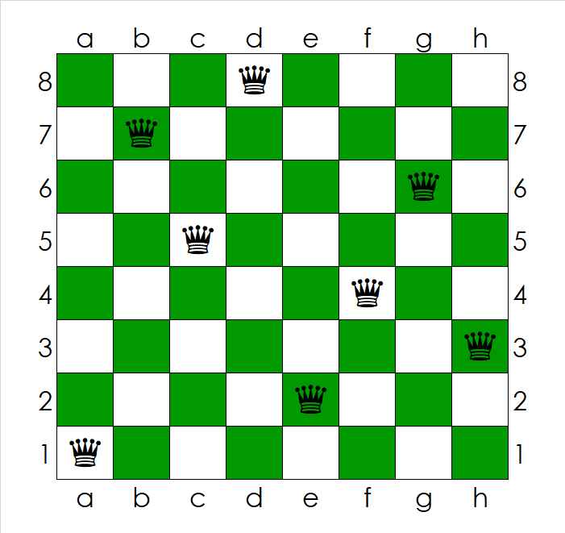
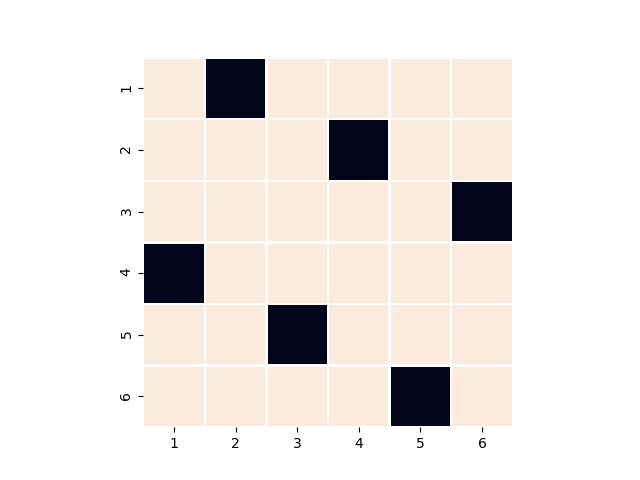

```{r setup, include=FALSE}
knitr::opts_chunk$set(echo = TRUE)
rm(list=ls())
install.packages("reticulate", repos="https://cran.rstudio.com/")
# install.packages("bookdown", repos="https://cran.rstudio.com/")
library(reticulate)
# library(bookdown)
```

# 1. Introduction
It is exciting to live in a time in which quantum computers are no longer a distant dream, but rather a reality (at least partially). According to IBM, "in five years, the effects of quantum computing will reach beyond the research lab. It will be used extensively by new categories of professionals and developers looking to this emerging method of computing to solve problems once considered unsolvable."\footnote{This was posted in 2018. See: https://www.research.ibm.com/5-in-5/quantum-computing/} So, what exactly is a quantum computer, how far are we from truly incorporating them into our daily lives, and what does quantum computing mean for statisticians? We will address these questions throughout this report.

Although we will begin our discussion with a description of quantum computing in general, we will soon focus on quantum annealers, quantum computers that focus on solving certain optimization problems. In the next section we describe how statisticians can take advantage of quantum annealers, and include Python code for solving a certain problem in experimental design. We will generally follow the outline of the paper by Foster et al. (2019).

## 1.1 What Is a Quantum Computer?
Very simply put, a quantum computer is a device that takes advantage of quantum-mechanical phenomena. The quantum world can behave strangely from the perspective of someone who has only ever lived in the "classical" world. We will soon discuss some of these "strange" phenomena, such as quantum superposition, tunneling, and entanglement. On the other hand, a quantum computer is *not* a device that will be able to solve all of our classical computing problems. The future will likely see an interplay between classical and quantum computers, each solving problems that are best suited to themselves.

```{r, echo=FALSE, out.width = '.25\\linewidth', fig.width=3, fig.height=3, fig.cap="An IBM quantum computer. (Lars Plougmann, https://www.flickr.com/photos/criminalintent/39660636671, Attribution-ShareAlike 2.0 Generic (CC BY-SA 2.0), https://creativecommons.org/licenses/by-sa/2.0/)", fig.align='center'}
knitr::include_graphics("IBM QC.png")
```

A regular bit on a computer can take on one of two values: 0 or 1. However, with a *quantum bit*, or *qubit*, this is not the case---a qubit can be in both states simultaneously. In reality, a quantum bit can be represented by a particle, such as an electron or a photon. In the former case, the 0 and 1 states can be taken to be the spin up and spin down states of the electron. For the latter case, the polarization of the photons can be used. Regardless, these quantum particles have the special property that they can be in a *superposition* of both states. We formally denote the 0 and 1 states by $|0\rangle$ and $|1\rangle$, which are orthonormal vectors in the complex plane. However, these two vectors simply represent physical states of the quantum particles. A qubit is of the form
$$ c_0 |0\rangle + c_1 |1\rangle,$$
with $c_0, c_1 \in \mathbb{C}$, and $|c_0| + |c_1| = 1$. Observing the qubit disrupts the system, and the qubit falls into the $|0\rangle$ or $|1\rangle$ state, with probabilities $|c_0|$ and $|c_1|$, respectively. Therefore, these qubits exist in a superposition of both states. This property can be taken advantage of to construct quantum annealers, quantum computers that can solve certain optimization problems. 

There are two other interesting properties of quantum particles that we will briefly discuss: quantum tunneling and quantum entanglement. Quantum tunneling refers to the ability of quantum particles to transition through certain barriers, achieving feats that would be impossible in the classical world. For example, quantum tunneling is important in nuclear fusion, and therefore very important for life on Earth. Quantum tunneling can be taken advantage of in order to find solutions to optimization problems without traversing around already known locally optimal solutions. An analogy is the ability of qubits to "tunnel" from one suboptimal state to another optimal state directly. Of course, these are all crude simplifications of reality, and any description that is more precise would require a greater knowledge of quantum physics.

Quantum entanglement, described by Albert Einstein as "spooky action at a distance" (see Buhrman, 1998), refers to quantum particles being ``entangled'', so that the state of one particle is related to the state of another particle. In fact, this relationship between the particles can exist even when the particles are separated by very large distances. Quantum entanglement can be used, for example, in quantum cryptography, as discussed by Ekert (1991).


## 1.2 Where Are We on the Quantum Computing Timeline?
The following question remains: where are we on the quantum computing timeline? To answer this question, it is important to distinguish between three types of quantum computers: quantum annealers, analog quantum computers, and universal quantum computers (see Desjardins, 2016). 

Basic quantum annealers are available to the public through the D-Wave Leap2 platform. They are generally viewed as the least powerful type of quantum computer, and are limited to solving certain types of optimization problems. These computers take advantage of quantum superposition and the adiabatic theorem, to be described in the next section. Unfortunately, advantages over classical computers with non-artificial problems are difficult to find. However, we will discuss some interesting applications of quantum annealers and discuss these devices in more detail.

Next, we should expect to see analog quantum computers becoming common. These computers will likely provide a true speedup over regular computers on certain tasks, taking advantage of even more properties of quantum particles. For example, these computers will be well-suited for solving problems in materials science and quantum chemistry. Of course, analog quantum computers will also be able to solve optimization problems, just like quantum annealers. It is worth mentioning that there is also a difference between what is available to the public at the moment and what exists in a laboratory as a prototype. More advanced quantum computers are likely still in an experimental state.

Finally, universal quantum computers will arrive, capable of solving a wide range of problems. These computers will contain many qubits and will make use of properties of quantum particles, both known and unknown to us at the moment. Machine learning and cryptography, as well as the previously mentioned areas, will be some possible application domains. For more applications of quantum computers, see Gossett (2019).

Quantum supremacy is a term that is often heard in the quantum computing realm. The term refers to the ability of a quantum computer to solve a certain problem that can not be solved on any classical computer within a reasonable time period. In October 2019, Google AI, in partnership with NASA, stated that they had achieved quantum supremacy (see Giles, 2019). They claimed that they had completed a task on a quantum computer in 200 seconds, whereas the same task would take around 10,000 years to complete on a supercomputer. However, IBM suggested that the claim of 10,000 years for completion time on a supercomputer was too large, believing that the task could be completed within 2.5 days. Even though Google's claim has been disputed (see Pednault et al., 2019), there seems to be a race to quantum supremacy, suggesting that it might not be as far away as we think.


# 2. Quantum Annealing in Statistics
This section will discuss quantum annealing and its applications in statistics, ending with a Python code example that can be run on a D-Wave 2000Q quantum computer. This computer is in fact a quantum annealer, capable of solving various optimization problems. Admittedly, the amount of computing resources publicly available via the D-Wave 2000Q is not much. D-Wave computers have also been criticized to a certain extent, and other approaches to quantum computing might take over D-Wave's approaches (see Gibney, 2017). However, as a publicly available computer, we will use the D-Wave 2000Q to illustrate some applications.

One minute of computing time is available for free via the D-Wave Leap2 platform, and usually 400 to 4000 problems can be solved with one minute of quantum computing time on the D-Wave 2000Q.  We will therefore focus on problems in statistics that can be framed into a problem involving finding global minima or maxima of certain functions. Some examples of applications include maximum likelihood estimation, experimental design, and inversion of matrices. We will also discuss some other applications including feature selection and an application in computational biology, as discussed by Li et al. (2018). 

## 2.1 What Is Quantum Annealing?
It should first be emphasized that when one uses a quantum annealer to solve a certain optimization problem, solutions can differ across different runs of the quantum annealing algorithm. There are two main reasons for this occurrence: noise introduced by external physical forces onto the quantum computer, and the selected quantum annealing schedule or time. The first problem arises due to the fact that quantum computers need to be in very cold locations, subject to almost no vibrations or external magnetic forces. This problem might be overcome with time as physicists find better ways to create a stable environment for the computer. The latter problem is inherent to the quantum annealing process, which we will describe. Much like finite sample size distributional approximations that are made based on asymptotic results, quantum annealing is based on the adiabatic theorem, which guarantees results when the quantum annealing process is performed over an infinite amount of time. Therefore, one has to be quite clever when deciding how quickly to run the quantum annealing algorithm. Fortunately, this issue does not usually have to be handled by the user on the D-Wave 2000Q computer. 

Suppose we have at our disposal a quantum computer with $n_q$ qubits. We will denote these qubits by $q_i, i=1,\ldots, n_q$. We would like to find the $q_i \in \{0, 1\}$ that minimize
\begin{equation}
\label{eq:qubo}
  \text{Energy} = \sum_i a_i q_i + \sum_{i < j} b_{ij} q_i q_j.
\end{equation}
Equation (\ref{eq:qubo}) is referred to as the quadratic unconstrained binary optimization (QUBO) model. The Ising model is similar, except that we have $q_i \in \{-1, 1\}$. Both models can be handled by the D-Wave 2000Q. However, the form of the QUBO model is useful because in this case $q_i^2 = q_i$, illustrating more clearly that, in fact,
$$ \text{Energy} = (q_1, \ldots, q_{n_q}) A (q_1, \ldots, q_{n_q})^\top,$$
where $A$ is an $n_q \times n_q$ matrix with $(A)_{ii} = a_i$ and $(A)_{ij} = 1/2 b_{ij}$, defining $b_{ij} = b_{ji}$. Alternatively, we can define $A$ as an upper triangular matrix with diagonal elements given by the $a_i$'s, and off-diagonal elements in the upper-right half of the matrix given by the $b_{ij}$'s. For example, if $n_q=3$, we can represent the problem by the matrix
$$ A =       
\begin{bmatrix}
        a_1 & b_{12} & b_{13} \\
        0   & a_2    & b_{23} \\
        0   & 0      & a_3
\end{bmatrix}.$$
We can also represent the problem as a graph, with a vertex for each qubit, as shown in Figure 2. In Section 2.3 we will see that many problems can be placed into the QUBO model form. 
```{r, echo=FALSE, out.width = '.50\\linewidth', fig.width=3, fig.height=3, fig.cap="A QUBO model with 3 qubits represented as a graph. Each qubit is assigned to a vertex. Interactions between qubits are represented by edges between vertices with weights $b_{ij}$, and the weights for each qubit are represented as loops with edge values of $a_i$. (Inspired by http://www.guitex.org/home/images/doc/GuideGuIT/introingtikz.pdf and  https://tex.stackexchange.com/questions/57152/how-to-draw-graphs-in-latex.)", fig.align='center'}
knitr::include_graphics("ProblemAsGraph.png")
```

We now describe the adiabatic theorem, the linchpin of quantum annealing, in layman's terms. Suppose that we have an initial problem, $K_0$, for which the lowest energy state is easy to find. If we can find a way to slowly transition to our problem of interest\footnote{Again, for this discussion it is only necessary to know that it is possible to somehow "transition" between problems. Introducing the actual quantum physics behind the process would require an explanation of other (seemingly unrelated) concepts. For more information, see \url{https://docs.dwavesys.com/docs/latest/c_gs_2.html}, for example.}, $K_1$, starting from the qubits being in the lowest energy state of $K_0$, then the adiabatic theorem states that the qubits will remain in the lowest energy state throughout the transitioning process, thereby providing the desired solution to our problem of interest. However, the drawback is that these results are guaranteed when the transitioning time between the two problems is infinitely long, something which is obviously impossible to achieve. Therefore, when we perform quantum annealing we must transition to our problem of interest "slowly enough". If we represent our optimization problems $K_0$ and $K_1$ as matrices, we are then interested in transitioning to our problem, $K_1$, via the optimization problems, $K(s), 0 \leq s \leq 1$, given by
\begin{equation*}
  K(s) = A(s) K_0 + B(s) K_1,
\end{equation*}
where $A(0) > 0$, $B(0) = 0$, $A(1) = 0$, and $B(1) > 0$. This can be viewed as slowly changing the "landscape" of the problem, as displayed in Figure 3. 

```{r, echo=FALSE, out.width = '.49\\linewidth', fig.width=3, fig.height=3, fig.cap='A symbolic representation of the "changing landscape" during quantum annealing. On the left is the "landscape" of the inital problem, while on the right we have the "landscape" of our desired problem. By slowly changing the QUBO problem of which we would like to find an optimal solution, the qubits remain in the optimal state (provided that the transition is slow enough). (Created with https://www.desmos.com/calculator.)', fig.show='hold', fig.align='center'}
knitr::include_graphics("Anneal3.png")
knitr::include_graphics("Anneal1.png")
```

During the quantum annealing process, the qubits begin in superposition states. At the end of the process, however, the qubits are all in a classical state (i.e., 0 or 1). The details behind quantum annealing are mostly based on physics and are not included in this summary. 


## 2.2 The Chimera Structure
It is worth mentioning the problem of graph embedding at least briefly, even though this problem is largely dealt with automatically on the D-Wave 2000Q via the Leap2 platform. Suppose that we have a problem requiring $n_q$ qubits, and that there is an interaction between each of the qubits, i.e., $|b_{ij}| > 0$ for all $i \neq j$. This means that there are $\binom{n_q}{2}$ "edges" or interactions between these qubits in total. 

On the D-Wave 2000Q, the Chimera structure is used. With this structure, each qubit is connected to no more than six other qubits. 
Additionally, no three qubits in the whole Chimera structure are all connected to one another. Therefore, it is not even possible to directly solve a problem as simple as the one given by the graph in Figure 2, provided that all $b_{ij}$ are non-zero. Fortunately, there is a work-around to this problem if more qubits are available at our disposal. Finding a way to place our problem, represented as a graph, onto the Chimera architecture is referred to as graph embedding. The idea is to introduce additional qubits that act as intermediaries, allowing for indirect interactions between qubits that could not normally be in interaction with each other on the regular Chimera structure. Essentially, having too many $b_{ij} \neq 0$ in a problem results in requiring more than $n_q$ qubits. More details are given in Foster et al. (2019). Through the D-Wave Leap2 platform one rarely has to worry about graph embeddings because a Python function exists that automatically deals with this task to a certain extent.


## 2.3 Potential Uses and Examples
\label{sec:examples}
Three of our quantum annealing applications can be found in Foster et al. (2019), whereas the computational biology example is from the work of Li et al. (2018). We will discuss applications in maximum likelihood estimation, experimental design, matrix inversion (useful, for example, in Gaussian process regression), and applications in computational biology as well as feature selection.

### 2.3.1 Maximum Likelihood Estimation
Maximum likelihood estimation is very common in statistics, and it is clear that this is an optimization problem. That is, for $X_1, \ldots, X_n \stackrel{iid}{\sim} f(x|\theta)$, we find the $\theta$ that maximizes the log-likelihood,
$$l(\theta|\mathbf{x}) = \sum_{d=1}^n l(\theta|x_d),$$
where $l(\theta|x_d) = \log(f(x_d|\theta))$. To place this into QUBO form to be solved on a quantum annealer, if we have $n_q$ qubits, $q_1, \ldots, q_{n_q}$, we can express $\theta$ (within a certain degree of accuracy) as a sum of powers of two, as follows:
$$ \theta = \sum_{j=1}^{n_q} 2^{p_j} q_{j},$$
where $p_j \in P$, a set containing $n_q$ integers. Depending on the nature of $l(\theta|\mathbf{x})$, we might not be able to state our problem directly in QUBO form even if we replace $\theta$ with $\sum_{j=1}^{n_q} 2^{p_j} q_{j}$. Therefore, we use a second-order Taylor series approximation of $l(\theta|\mathbf{x})$ about some initial guess, $\theta^{(0)}$, so that
$$ l(\theta|\mathbf{x}) \approx \sum_{i=1}^{n_q} a_i q_i + \sum_{i < j} b_{ij} q_i q_j,$$
for some $a_i$, $b_{ij}$. We then use the quantum annealer to obtain a second guess, $\theta^{(1)}$, and repeat the process. The same idea can be used for multiple parameters.

### 2.3.2 Experimental Design
For experimental design problems, according to Foster et al. (2019), "finding an optimal design generally scales exponentially ... and quantum annealing may provide a polynomial increase in computational speed for high dimensional problems." To see such a problem in action, we consider the $N$-Queens problem. The goal is to place $N$ queens on an $N \times N$ chess board so that no two queens are in line with each other. Equivalently, we should place the queens so that there is one in each row, column, and forward or backward diagonal. An example of a solution to the $N$-Queens problem when $N=8$ is shown in Figure 4.
```{r, echo=FALSE, out.width = '.50\\linewidth', fig.width=3, fig.height=3, fig.cap="An example solution for the $N$-Queens problem when $N=8$. Note that there are many possible solutions, including some that are easily obtained by introducing rotations or reflections. (Encik Tekateki, https://bit.ly/3arSo1r, Attribution-ShareAlike 4.0 International (CC BY-SA 4.0), https://creativecommons.org/licenses/by-sa/4.0/deed.en)", fig.align='center'}

```
It is possible to place the $N$-Queens problem into QUBO form. One begins by assigning a qubit to each cell of the grid. Therefore, for a $6 \times 6$ grid, for example, one needs at least 36 qubits. Then, the following weights, $a_i$, and interactions, $b_{ij}$, are introduced:
\begin{align*}
  a_i    &= -2, \\
  b_{ij} &= 
    \begin{cases}
      2, & q_i, q_j \text{ in same row or column} \\
      1, & q_i, q_j \text{ on same diagonal} \\
      0, & \text{otherwise}
    \end{cases}.
\end{align*}
This means that whenever we add a "queen" to the board (i.e., we activate an additional qubit by setting its value to 1), the energy function decreases by 2 points. However, if this new qubit is in the same row or column as another activated qubit, a penalty of 2 points is applied. Similarly, if the qubit is on the same diagonal as another active qubit, a penalty of 1 point is applied. Note that the lowest energy level is attained when there are $N$ queens placed on the $N \times N$ board so that no two queens are in the same row, column, or diagonal. In this case, the energy level is $-2N$. It is also not necessary to have a different penalty for queens lying on the same row/column and diagonal. As discussed by Foster et al. (2019), however, due to the stochastic nature of the quantum annealing process, in the case that a global minimum is not found, the different penalties serve as a way to lean toward solutions that do not place queens in the same row or column. 

One can imagine that the $N$-Queens problem is representative of a real experimental design problem, due to the balance and spacing of the queens on the chess board. We will show how to solve the $N$-queens problem in the next subsection. Another possible application of quantum annealing is in finding Latin hypercubes. 

### 2.3.3 Inversion of Large Matrices
Inversion of large matrices can occur, for instance, in Gaussian process regression. Unfortunately, matrix inversion can take a noticeable amount of time. For this reason, Gaussian processes might be avoided even if they are a seemingly natural solution to the problem at hand. However, it is possible to view matrix inversion as an optimization problem, as described in more detail by Foster et al. (2019) and Jang et al. (1988). We will not go into the mathematical details here, but it is worth mentioning that with the D-Wave 2000Q, matrix inversion is not very stable and it is likely much better to use a classical computer. 

### 2.3.4 Other Examples
Transcription factors are proteins that bind to DNA and regulate the rate at which DNA information is encoded onto RNA (see Latchman, 1997). Li et al. (2018) ranked transcription factor binding affinities using a quantum annealer. They found "a slight advantage in classification performance and nearly equal ranking performance using the quantum annealer", and that "quantum annealing might be an effective method to implement machine learning for certain computational biology problems".

It is also possible to use quantum annealers to perform feature selection. This is illustrated in detail through the "MIQUBO Method of Feature Selection" example on the D-Wave Leap2 dashboard. The idea is to select features based on mutual information of pairs of random variables (a concept similar to correlation). It is then possible to frame feature selection into the QUBO framework, to a certain extent.


## 2.4 N-Queens Problem Demo
We now go through an example of how to solve the $N$-Queens problem on a D-Wave 2000Q quantum computer. The full code (with no commentary between code chunks), along with information on the Apache license, can be found in the appendix. Details on how to run code are given in the appendix, as well. (**Remark:** My version of the code is a modification of the code that is available on the D-Wave Leap2 examples page for "Mutual Information Feature Selection". The first few lines of code that import various libraries are mostly from the template, whereas the code in between "def run_demo()" and "bqm.normalize()" is mostly mine. Setting up the QPU sampler is common in the templates, but the "display results" section is my modification for printing a checkerboard and displaying the results visually.)

We first import some commonly used libraries. Some of these are for plotting or performing mathematical calculations. The last few libraries are for using the D-Wave quantum computer.
```{python, eval=FALSE}
import itertools
import os
import matplotlib
matplotlib.use("agg")    # must select backend before importing pyplot
import matplotlib.pyplot as plt
import matplotlib.colors as colors
import numpy as np
import pandas as pd
from mlxtend.plotting import checkerboard_plot # pip install mlxtend 
import seaborn # pip install seaborn
import math

# D-Wave Ocean tools
import dimod
from dwave.embedding.chimera import find_clique_embedding
from dwave.system import DWaveSampler, FixedEmbeddingComposite
from dimod.reference.samplers import ExactSolver
import neal
```

We now assess the main part of the code. First, we declare that we would like to construct a QUBO-type problem, placing relevant information into the "bqm" variable (binary quadratic model).
```{python, eval=FALSE}
bqm = dimod.BinaryQuadraticModel.empty(dimod.BINARY)
```
Next, we indicate that we would like to solve the $N$-Queens problem for $N=6$. We also introduce the 36 qubits, which are named "1", ..., "36".
```{python, eval=FALSE}
n = 6
qubits = list(range(1,n**2+1))
qubits = [str(qubit) for qubit in qubits]
```
The next section of code creates four matrices (in vector form, row by row), "rows", "columns", "fw_diags" (forward diagonals), and "bw_diags" (backward diagonals). These matrices have the following forms (for $N=4$, for example):
$$ \begin{bmatrix}
        1 & 1 & 1 & 1 \\
        2 & 2 & 2 & 2 \\
        3 & 3 & 3 & 3 \\
        4 & 4 & 4 & 4
\end{bmatrix},
\begin{bmatrix}
        1 & 2 & 3 & 4 \\
        1 & 2 & 3 & 4 \\
        1 & 2 & 3 & 4 \\
        1 & 2 & 3 & 4
\end{bmatrix},
\begin{bmatrix}
        1 & 2 & 3 & 4 \\
        2 & 3 & 4 & 5 \\
        3 & 4 & 5 & 6 \\
        4 & 5 & 6 & 7
\end{bmatrix},
\begin{bmatrix}
        4 & 5 & 6 & 7 \\
        3 & 4 & 5 & 6 \\
        2 & 3 & 4 & 5 \\
        1 & 2 & 3 & 4
\end{bmatrix}.$$
The matrices will be useful for identifying whether two qubits are in the same row, column, or diagonal. The seemingly complex code allows for easy generalization to larger values of $N$ by simply replacing the variable "n" with the desired value.
```{python, eval=FALSE}
rows = list(range(1,n+1))
rows = np.repeat(rows, n)

columns = list(range(1,n+1))
columns = np.tile(columns, n)

fw_diags = list(range(1,n**2+1))
for i in list(range(0,n**2)):
  fw_diags[i] = list(range(1,n+1))[(i)%n] + math.floor(i/n) 

bw_diags = list(range(1,n**2+1))
for i in list(reversed(range(0,n**2))):
  bw_diags[i] = list(range(1,n+1))[i%n] + (n - math.floor(i/n) -1)
```
We now define the "rewards" for activating a qubit, and the "penalties" for having two qubits active in the same row, column, or diagonal.
```{python, eval=FALSE}
a_i = -2
row_penalty = 2
diag_penalty = 1
other_penalty = 0
```
Finally, for each qubit we explicitly declare in our binary quadratic model ("bqm") that we would like to assign the previously declared reward for activating a qubit, $a_i$. For each pair of qubits, we assess whether the two qubits are in the same row, column, or diagonal, and then assign the appropriate penalty, $b_{ij}$.
```{python, eval=FALSE}
for qubit in qubits:
  bqm.add_variable(qubit, a_i)

for q1, q2 in itertools.combinations(qubits, 2):
  q1_num = int(q1)
  q2_num = int(q2)
  row1 = rows[q1_num-1]
  row2 = rows[q2_num-1]
  col1 = columns[q1_num-1]
  col2 = columns[q2_num-1]
  fwd1 = fw_diags[q1_num-1]
  fwd2 = fw_diags[q2_num-1]
  bwd1 = bw_diags[q1_num-1]
  bwd2 = bw_diags[q2_num-1]

if row1==row2:
  bqm.add_interaction(q1, q2, row_penalty)
  bqm.add_interaction(q2, q1, row_penalty)
elif col1==col2:
  bqm.add_interaction(q1, q2, row_penalty)
  bqm.add_interaction(q2, q1, row_penalty)
elif fwd1==fwd2:
  bqm.add_interaction(q1, q2, diag_penalty)
  bqm.add_interaction(q2, q1, diag_penalty)
elif bwd1==bwd2:
  bqm.add_interaction(q1, q2, diag_penalty)
  bqm.add_interaction(q2, q1, diag_penalty)
else:
  bqm.add_interaction(q1, q2, other_penalty)
  bqm.add_interaction(q2, q1, other_penalty)
```
We now normalize the binary quadratic model, since each of the $a_i$ and $b_{ij}$ should lie within a certain range.
```{python, eval=FALSE}
bqm.normalize()  # Normalize biases & interactions to the range -1, 1
```
Next, we indicate that we would like to solve the problem on a quantum computer (rather than a classical computer or a hybrid), and set the size of the Chimera lattice. Often, the default Chimera lattice size (16, 16, 4) works. Then, we say that we would like to perform quantum annealing 1000 times to ensure that we have attained a global minimum. Setting this value to 100 is sometimes not enough, whereas setting it to 1000 usually works for this problem.
```{python, eval=FALSE}
# Set up a QPU sampler with a fully-connected graph of all of the variables
qpu_sampler = DWaveSampler(solver={'qpu': True})
embedding = find_clique_embedding(bqm.variables,
                                  16, 16, 4,  # size of the chimera lattice
                                  target_edges=qpu_sampler.edgelist)
sampler = FixedEmbeddingComposite(qpu_sampler, embedding)
sampleset = sampler.sample(bqm, num_reads=1000)
```
Finally, we display the results on a checkered grid and save the plot.
```{python, eval=FALSE}
# Display results
print(sampleset.first.sample)

ary = np.ones((1,n**2))
for qubit in qubits:
  ary[0][int(qubit)-1] = ary[0][int(qubit)-1] - sampleset.first.sample[qubit]
ary = np.reshape(ary, (n,n))

brd = seaborn.heatmap(ary, cbar=0, square=1, linewidths=1, 
                      xticklabels=[str(num) for num in list(range(1,n+1))],
                      yticklabels=[str(num) for num in list(range(1,n+1))])
plt.show()
plt.savefig('NQueensSolution.png')
```
Figure 5 displays an example of a solution obtained using a quantum computer (a different solution might be obtained on each run).
```{r, echo=FALSE, out.width = '.60\\linewidth', fig.width=3, fig.height=3, fig.cap="An example solution for the $N$-Queens problem with $N=6$, obtained using the D-Wave 2000Q computer. Note that there is exactly one queen in each row, column, and forward or backward diagonal. Obtaining a solution usually requires less than one second of computing time. However, on this publicly available quantum computer it is usually not possible to solve more complex problems (for example, with larger $N$).", fig.align='center'}

```


# 3. Summary and Discussion
Quantum computers, machines that take advantage of properties of quantum particles such as quantum superposition, entanglement, and tunneling, have the potential to transform our society much like regular computers did in the last few decades. Basic quantum annealers, quantum computers that can solve certain optimization problems, are now available to the general public. Several applications were illustrated throughout this report, suggesting that quantum computers have great potential. Many fields of science will likely start to welcome quantum computers as a useful tool to be used in conjunction with classical computers.

Where are we on the quantum computing timeline? According to IBM, the next few years will see a rise in the popularity of the quantum computer. Whether or not quantum computers are so close to becoming commonplace is a difficult question to answer, but it seems certain that eventually quantum computers will become indispensable. The next type of non-experimental quantum computer, an "analog quantum computer", will likely be capable of solving various problems in (for example) materials science. The last stage will showcase the "universal quantum computer", a computer capable of solving a vast number of problems that are very difficult for classical computers.

We also demonstrated the D-Wave Leap2 platform and developed code to solve the $N$-Queens problem, with $N=6$, on a quantum computer using quantum annealing. On the D-Wave 2000Q, setting $N>6$ will likely result in a problem that is too difficult to solve. This is a limitation due to the fact that we are in the beginning stages of quantum computing, and the chosen quantum computer is publicly available and not the most powerful on the market. However, there are many interesting examples for the D-Wave 2000Q available online, such as the "MIQUBO Method of Feature Selection", "Clustering", and "Qboost" examples. Readers are encouraged to experiment and learn more about quantum computing. 

\newpage

\includepdf[pages=-]{Bibliography.pdf}

\newpage

# Appendix
Below is the full Python code for running the $N$-Queens example on the D-Wave 2000Q computer. The Apache License, Version 2.0 (link given in the code) allows for public display and modification of the code. Here are the steps to get the code running (I checked that this works in a new workspace):
\begin{enumerate}
  \item Obtain a D-Wave Leap2 account: https://cloud.dwavesys.com/leap/signup/
  \item Once in the dashboard, go to "explore our examples".
  \item Click on the "MIQUBO Method of Feature Selection" example and "Load in IDE".
  \item Install the appropriate Python libraries by opening the terminal: "Terminal > New Terminal", and then typing "pip install mlxtend" and "pip install seaborn" into the terminal. 
  \item Replace the code in "titanic.py" with the code below.
  \item Right click on "titanic.py" and select "Run Python File in Terminal".
\end{enumerate}
It might take 15-30 seconds for the code to be sent to a quantum computer.

```{python, eval=FALSE}
# Copyright 2019 D-Wave Systems Inc.
#
# Licensed under the Apache License, Version 2.0 (the "License");
# you may not use this file except in compliance with the License.
# You may obtain a copy of the License at
#
#     http://www.apache.org/licenses/LICENSE-2.0
#
# Unless required by applicable law or agreed to in writing, software
# distributed under the License is distributed on an "AS IS" BASIS,
# WITHOUT WARRANTIES OR CONDITIONS OF ANY KIND, either express or implied.
# See the License for the specific language governing permissions and
# limitations under the License.

# THIS FILE HAS BEEN MODIFIED FROM ITS ORIGINAL (mutual-information-feature-selection)

# Mostly from D-Wave (I added some libraries)------------------------------
import itertools
import os
import matplotlib
matplotlib.use("agg")    # must select backend before importing pyplot
import matplotlib.pyplot as plt
import matplotlib.colors as colors
import numpy as np
import pandas as pd
from mlxtend.plotting import checkerboard_plot # pip install mlxtend 
import seaborn # pip install seaborn
import math

# D-Wave Ocean tools
import dimod
from dwave.embedding.chimera import find_clique_embedding
from dwave.system import DWaveSampler, FixedEmbeddingComposite
from dimod.reference.samplers import ExactSolver
import neal
# ----------------------------------------------------------------------

def run_demo():
    # Declare a binary quadratic model
    bqm = dimod.BinaryQuadraticModel.empty(dimod.BINARY)
    
    # Mostly me -----------------------------------------------------------
    n = 6 # Size of grid is n x n
    qubits = list(range(1,n**2+1))
    qubits = [str(qubit) for qubit in qubits] # Name the qubits
    
    # Create "matrices" for rows, columns, and diagonals
    rows = list(range(1,n+1))
    rows = np.repeat(rows, n)

    columns = list(range(1,n+1))
    columns = np.tile(columns, n)

    fw_diags = list(range(1,n**2+1))
    for i in list(range(0,n**2)):
        fw_diags[i] = list(range(1,n+1))[(i)%n] + math.floor(i/n) 

    bw_diags = list(range(1,n**2+1))
    for i in list(reversed(range(0,n**2))):
        bw_diags[i] = list(range(1,n+1))[i%n] + (n - math.floor(i/n) -1)

    # Define penalties and rewards
    a_i = -2
    row_penalty = 2
    diag_penalty = 1
    other_penalty = 0
    
    # Whenever a qubit is activated, add this reward
    for qubit in qubits:
        bqm.add_variable(qubit, a_i)

    # If two qubits are in the same row, column, or diagonal
    # Add the appropriate penalty
    for q1, q2 in itertools.combinations(qubits, 2):
        q1_num = int(q1)
        q2_num = int(q2)
        row1 = rows[q1_num-1]
        row2 = rows[q2_num-1]
        col1 = columns[q1_num-1]
        col2 = columns[q2_num-1]
        fwd1 = fw_diags[q1_num-1]
        fwd2 = fw_diags[q2_num-1]
        bwd1 = bw_diags[q1_num-1]
        bwd2 = bw_diags[q2_num-1]

        if row1==row2:
            bqm.add_interaction(q1, q2, row_penalty)
            bqm.add_interaction(q2, q1, row_penalty)
        elif col1==col2:
            bqm.add_interaction(q1, q2, row_penalty)
            bqm.add_interaction(q2, q1, row_penalty)
        elif fwd1==fwd2:
            bqm.add_interaction(q1, q2, diag_penalty)
            bqm.add_interaction(q2, q1, diag_penalty)
        elif bwd1==bwd2:
            bqm.add_interaction(q1, q2, diag_penalty)
            bqm.add_interaction(q2, q1, diag_penalty)
        else:
            bqm.add_interaction(q1, q2, other_penalty)
            bqm.add_interaction(q2, q1, other_penalty)

    # ---------------------------------------------------------------
            
    # Mostly from D-Wave and modified --------------------------------------------
    # These are mostly settings that shouldn't really be tampered with
    bqm.normalize()  # Normalize biases & interactions to the range -1, 1

    # Sets up a CPU solver that goes through all 2^(n^2) configurations
    # Can become time consuming!
    #mys = ExactSolver()
    #ans = mys.sample(bqm)


    # Set up a QPU sampler with a fully-connected graph of all the variables
    qpu_sampler = DWaveSampler(solver={'qpu': True})
    embedding = find_clique_embedding(bqm.variables,
                                      16, 16, 4,  # size of the chimera lattice
                                      target_edges=qpu_sampler.edgelist)
    sampler = FixedEmbeddingComposite(qpu_sampler, embedding)
    sampleset = sampler.sample(bqm, num_reads=1000)


    # Sets up a CPU sampler (using simulated annealing)
    #mys = neal.SimulatedAnnealingSampler()
    #ans = mys.sample(bqm, num_reads=1000)
    # ------------------------------------------------------------------
    
    # A combination of my code / from D-Wave example -------------------
    # I made the checkerboard, using a heatmap and an array
    # Display results
    print(sampleset.first.sample)

    ary = np.ones((1,n**2))
    for qubit in qubits:
        ary[0][int(qubit)-1] = ary[0][int(qubit)-1] - sampleset.first.sample[qubit]
    ary = np.reshape(ary, (n,n))

    brd = seaborn.heatmap(ary, cbar=0, square=1, linewidths=1, 
                          xticklabels=[str(num) for num in list(range(1,n+1))],
                          yticklabels=[str(num) for num in list(range(1,n+1))])
    plt.show()
    plt.savefig('NQueensSolution.png')


if __name__ == "__main__":
    run_demo()
```

\newpage

# Apache License

Version 2.0, January 2004  
http://www.apache.org/licenses/  
TERMS AND CONDITIONS FOR USE, REPRODUCTION, AND DISTRIBUTION

\begin{tiny} 1. Definitions.

"License" shall mean the terms and conditions for use, reproduction, and distribution as defined by Sections 1 through 9 of this document.

"Licensor" shall mean the copyright owner or entity authorized by the copyright owner that is granting the License.

"Legal Entity" shall mean the union of the acting entity and all other entities that control, are controlled by, or are under common control with that entity. For the purposes of this definition, "control" means (i) the power, direct or indirect, to cause the direction or management of such entity, whether by contract or otherwise, or (ii) ownership of fifty percent (50%) or more of the outstanding shares, or (iii) beneficial ownership of such entity.

"You" (or "Your") shall mean an individual or Legal Entity exercising permissions granted by this License.

"Source" form shall mean the preferred form for making modifications, including but not limited to software source code, documentation source, and configuration files.

"Object" form shall mean any form resulting from mechanical transformation or translation of a Source form, including but not limited to compiled object code, generated documentation, and conversions to other media types.

"Work" shall mean the work of authorship, whether in Source or Object form, made available under the License, as indicated by a copyright notice that is included in or attached to the work (an example is provided in the Appendix below).

"Derivative Works" shall mean any work, whether in Source or Object form, that is based on (or derived from) the Work and for which the editorial revisions, annotations, elaborations, or other modifications represent, as a whole, an original work of authorship. For the purposes of this License, Derivative Works shall not include works that remain separable from, or merely link (or bind by name) to the interfaces of, the Work and Derivative Works thereof.

"Contribution" shall mean any work of authorship, including the original version of the Work and any modifications or additions to that Work or Derivative Works thereof, that is intentionally submitted to Licensor for inclusion in the Work by the copyright owner or by an individual or Legal Entity authorized to submit on behalf of the copyright owner. For the purposes of this definition, "submitted" means any form of electronic, verbal, or written communication sent to the Licensor or its representatives, including but not limited to communication on electronic mailing lists, source code control systems, and issue tracking systems that are managed by, or on behalf of, the Licensor for the purpose of discussing and improving the Work, but excluding communication that is conspicuously marked or otherwise designated in writing by the copyright owner as "Not a Contribution."

"Contributor" shall mean Licensor and any individual or Legal Entity on behalf of whom a Contribution has been received by Licensor and subsequently incorporated within the Work.

2. Grant of Copyright License. Subject to the terms and conditions of this License, each Contributor hereby grants to You a perpetual, worldwide, non-exclusive, no-charge, royalty-free, irrevocable copyright license to reproduce, prepare Derivative Works of, publicly display, publicly perform, sublicense, and distribute the Work and such Derivative Works in Source or Object form.

3. Grant of Patent License. Subject to the terms and conditions of this License, each Contributor hereby grants to You a perpetual, worldwide, non-exclusive, no-charge, royalty-free, irrevocable (except as stated in this section) patent license to make, have made, use, offer to sell, sell, import, and otherwise transfer the Work, where such license applies only to those patent claims licensable by such Contributor that are necessarily infringed by their Contribution(s) alone or by combination of their Contribution(s) with the Work to which such Contribution(s) was submitted. If You institute patent litigation against any entity (including a cross-claim or counterclaim in a lawsuit) alleging that the Work or a Contribution incorporated within the Work constitutes direct or contributory patent infringement, then any patent licenses granted to You under this License for that Work shall terminate as of the date such litigation is filed.

4. Redistribution. You may reproduce and distribute copies of the Work or Derivative Works thereof in any medium, with or without modifications, and in Source or Object form, provided that You meet the following conditions:

You must give any other recipients of the Work or Derivative Works a copy of this License; and
You must cause any modified files to carry prominent notices stating that You changed the files; and
You must retain, in the Source form of any Derivative Works that You distribute, all copyright, patent, trademark, and attribution notices from the Source form of the Work, excluding those notices that do not pertain to any part of the Derivative Works; and
If the Work includes a "NOTICE" text file as part of its distribution, then any Derivative Works that You distribute must include a readable copy of the attribution notices contained within such NOTICE file, excluding those notices that do not pertain to any part of the Derivative Works, in at least one of the following places: within a NOTICE text file distributed as part of the Derivative Works; within the Source form or documentation, if provided along with the Derivative Works; or, within a display generated by the Derivative Works, if and wherever such third-party notices normally appear. The contents of the NOTICE file are for informational purposes only and do not modify the License. You may add Your own attribution notices within Derivative Works that You distribute, alongside or as an addendum to the NOTICE text from the Work, provided that such additional attribution notices cannot be construed as modifying the License.

You may add Your own copyright statement to Your modifications and may provide additional or different license terms and conditions for use, reproduction, or distribution of Your modifications, or for any such Derivative Works as a whole, provided Your use, reproduction, and distribution of the Work otherwise complies with the conditions stated in this License.
5. Submission of Contributions. Unless You explicitly state otherwise, any Contribution intentionally submitted for inclusion in the Work by You to the Licensor shall be under the terms and conditions of this License, without any additional terms or conditions. Notwithstanding the above, nothing herein shall supersede or modify the terms of any separate license agreement you may have executed with Licensor regarding such Contributions.

6. Trademarks. This License does not grant permission to use the trade names, trademarks, service marks, or product names of the Licensor, except as required for reasonable and customary use in describing the origin of the Work and reproducing the content of the NOTICE file.

7. Disclaimer of Warranty. Unless required by applicable law or agreed to in writing, Licensor provides the Work (and each Contributor provides its Contributions) on an "AS IS" BASIS, WITHOUT WARRANTIES OR CONDITIONS OF ANY KIND, either express or implied, including, without limitation, any warranties or conditions of TITLE, NON-INFRINGEMENT, MERCHANTABILITY, or FITNESS FOR A PARTICULAR PURPOSE. You are solely responsible for determining the appropriateness of using or redistributing the Work and assume any risks associated with Your exercise of permissions under this License.

8. Limitation of Liability. In no event and under no legal theory, whether in tort (including negligence), contract, or otherwise, unless required by applicable law (such as deliberate and grossly negligent acts) or agreed to in writing, shall any Contributor be liable to You for damages, including any direct, indirect, special, incidental, or consequential damages of any character arising as a result of this License or out of the use or inability to use the Work (including but not limited to damages for loss of goodwill, work stoppage, computer failure or malfunction, or any and all other commercial damages or losses), even if such Contributor has been advised of the possibility of such damages.

9. Accepting Warranty or Additional Liability. While redistributing the Work or Derivative Works thereof, You may choose to offer, and charge a fee for, acceptance of support, warranty, indemnity, or other liability obligations and/or rights consistent with this License. However, in accepting such obligations, You may act only on Your own behalf and on Your sole responsibility, not on behalf of any other Contributor, and only if You agree to indemnify, defend, and hold each Contributor harmless for any liability incurred by, or claims asserted against, such Contributor by reason of your accepting any such warranty or additional liability.

END OF TERMS AND CONDITIONS \end{tiny}

